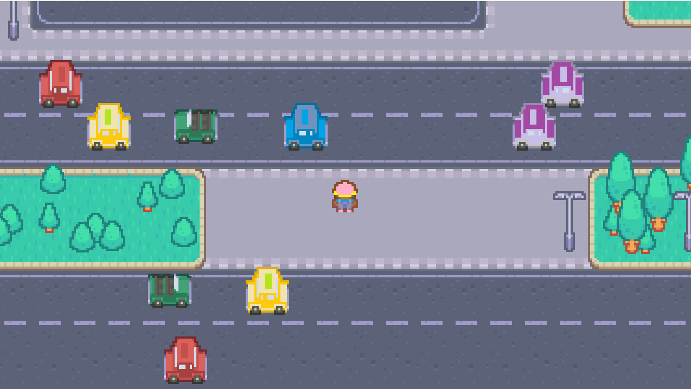
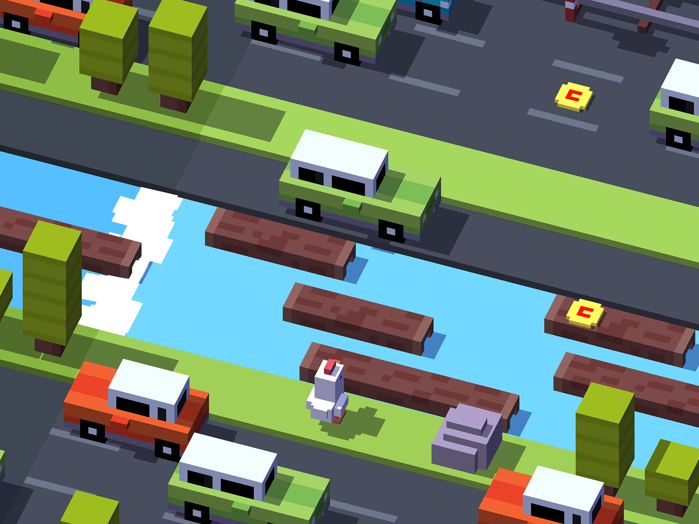

# Game Design Document - Highway Havoc

Repozitár obsahuje hru "Highway Havoc", ktorá je mojim semestrálnym projektom ku skúške z predmetu "Objektové technológie" na FPVaI, UKF.

**Autor:** Michal Smatana

**Zvolená téma:** One level, but constantly changing 

# 1. Úvod
Pre môj projekt som si zvolil tému "One level, but constantly changing". V hre sa hráč nachádza na diaľnici alebo cestách, ako prekážky má autá, ktorým sa musí vyhnúť a dostať sa do cieľa.

Snímka hráča na chodníku

## 1.1 Inšpirácia
Téma "One level, but constantly changing" ma zaujala, pretože ako malý som často hrával hru "Crossy road", kde hráte za sliepku a váš cieľ je sa dostať do cieľa a vyhýbať sa všetkým autám. Tento repozitár obsahuje prototyp jednoduchšej verzie hernej mechaniky.

Moja inšpirácia

### 1.2 Herný zážitok
Hráč sa ocitne na chodníku pred cestou, cez ktorú má úspešne prejsť, vyhnúť sa idúcim autám a dostať sa do cieľa.

### 1.3 Použitý softvér
* Pygame Community Edition (v2.5.2)
* Python 3.13.1
* Tiled 1.11.0 - pre tvorbu levelu a objektov v hre

# 2. Koncept
Táto hra sa odohráva v jednom leveli, ktorý sa neustále mení. Hráč ovláda postavu, ktorá sa pohybuje po dynamicky sa vyvíjajúcom prostredí, kde sa neustále objavujú nové prekážky, ako autá a rôzne objekty, ktoré sa náhodne spúšťajú a pohybujú.
## 2.1 Kľúčové prvky
* **Pohyb hráča a interakcia:** Hráč sa môže pohybovať v štyroch smeroch a musí sa vyhýbať prekážkam, ako sú autá a iné objekty. Ak dôjde ku kolízii s autom, hra končí.
* **Dynamické prekážky:** Auta sa objavujú na náhodných miestach a pohybujú sa v oboch smeroch po obrazovke. Nové autá sa periodicky spúšťajú, čím sa zvyšuje náročnosť.
* **Pozadie a aktualizácia spriteov:** Pozadie sa posúva podľa pozície hráča, čo vytvára dojem, že sa svet neustále mení. Prekážky a objekty sa pridávajú a odstraňujú počas hry.
* **Podmienka na víťazstvo:** Hra končí, keď hráč dosiahne určité miesto (v tomto prípade keď hodnota Y hráča presiahne 1000). Vtedy sa zastaví hudba a zobrazí sa správa o víťazstve.

### Hra je postavená na Pygame, využíva animácie, detekciu kolízií a časové udalosti, ktoré prispievajú k dynamickému a nepredvídateľnému prostrediu.

### 2.2 Návrh tried
* **Sprite:** Reprezentuje základný herný objekt, ktorý je zobrazený na obrazovke. Obsahuje obraz (image), pozíciu (rect), a hitbox, ktorý sa používa na detekciu kolízií.
* **Sprite2:** Rozširuje Sprite. Je podobná triede Sprite, ale s upraveným hitboxom, ktorý je menší a posunutý dolu.
* **Car:** Reprezentuje auto na obrazovke. Náhodne vyberá auto zo zoznamu obrázkov, nastaví jeho pohyb vpravo alebo vľavo a sleduje jeho pozíciu. Ak sa auto dostane mimo obrazovky, odstráni sa.
* **Player:** Reprezentuje hráča. Obsahuje animácie pre pohyb hráča v rôznych smeroch, spravuje vstupy od hráča (pohyb, skoky), detekuje kolízie so spritmi a upravuje pozíciu hráča na základe fyziky.
* **Timer & Hudba:** Nastavuje časovač a prehráva hudbu na pozadí, pričom pravidelne vytvára nové autá, až kým ich počet nepresiahne 5.
**Tento návrh tried robí hru rozšíriteľnú a udržiavateľnú, pričom jednotlivé triedy majú jasne definované zodpovednosti, ako napríklad správa pohybu, kolízií, animácií a herných objektov.**
* 
